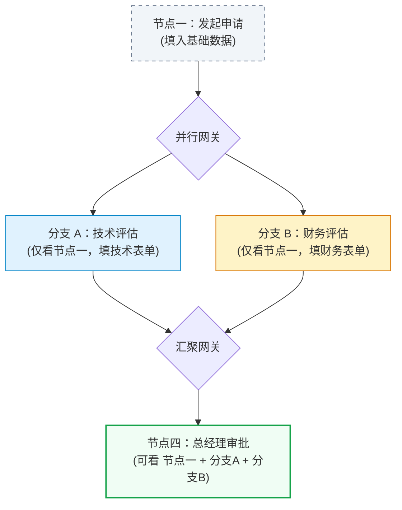
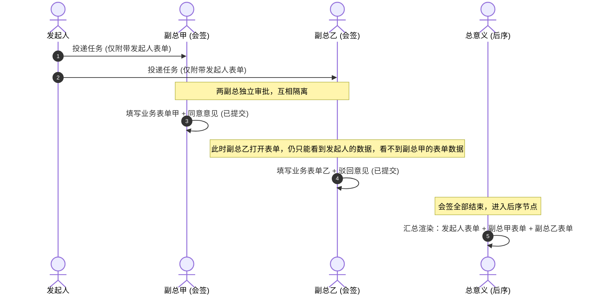

# 会签、票签与并行分支场景下的表单可见性设计指南

在复杂的工作流中，**并发执行**（如同一个节点多人的会签/票签，或多个并行的分支）对表单的数据权限控制提出了更高的要求。

您的理解是**完全正确**的。在流转过程中，为了保证“独立决策权”与“业务拓扑隔离”，并发节点通常**只能看到上游前序节点的数据，无法看到同级并发节点或另一条分支节点上正在填写的数据**。

---

## ➊ 并行分支场景下的表单可见性（拓扑隔离）

当流程经过“并行网关”分叉为两条独立的分支（如：技术审批分支 与 财务审批分支）同时运行时：

### 数据流向图：


### 权限与呈现规则：
1. **分支 A（技术评估）** 只能看到 **节点一（发起申请）** 的只读数据，**完全看不到分支 B（财务评估）** 的任何表单。因为在流程图的拓扑关系上，分支 B 并非分支 A 的历史前序节点。
2. **分支 B（财务评估）** 同样只能看到 **节点一**，看不到 **分支 A**。
3. 当且仅当两条分支全部处理完毕、在**汇聚网关**合并，并流转到 **节点四（总经理审批）** 时，总经理才能作为“后置节点”，同时以只读形式调取并展示 **分支 A 的技术表单** 和 **分支 B 的财务表单**，进行汇总审批。

---

## ➋ 会签 / 票签场景下的表单可见性（防盲从/业务隔离）

会签或票签指的是**同一个节点上，分配了多个审批人**（如：副总经理会签，包含副总甲、副总乙、副总丙三人同时审批）：

### 为什么不能相互查看（盲签原则）：
在实际的企事业单位审批中，为了防止**“盲从效应”**（即副总乙看到副总甲写了“同意，方案可行”，为了省事或避免冲突也直接照抄），系统设计需要保证会签人之间的**决策独立性**：



### 权限与呈现规则：
* **会签进行中**：所有会签人打开表单时，只能看到**上一步（节点一）**的内容。他们之间的数据是横向物理隔离的。
* **会签结束后**：当会签节点的所有人都提交完毕，流程进入下一个节点（如总经理）后，之前的多份会签表单数据才会“解密”并汇聚，作为只读的历史审批数据一次性呈现在总经理面前。

---

## 🛠️ 3. 数据库与接口集成层面的实现逻辑

对于上述场景，后端提供给前端 `formCreate.vue` 初始化接口的数据需要按如下逻辑进行过滤：

### 1. 业务表单数据表设计 (表单实例表)
在存储自定义表单数据时，建议按以下结构关联：
```json
{
  "taskId": "task_9988",
  "flowInstanceId": "flow_inst_001",
  "nodeCode": "tech_approve",
  "operatorId": "user_vp_1",
  "formData": { "techScore": 95, "techOpinion": "符合规范" }
}
```

### 2. 接口反显数据过滤规则
当 `formCreate.vue` 调用数据加载接口时，后端根据当前请求的用户 `userId` 和任务 `taskId` 动态查询并拼装历史表单数据：

* **如果是普通节点（如节点二）**：
  - 查询 `flowInstanceId` 下，所有处于**拓扑上游节点**（即已经走过的历史路径）的表单数据。
  - 过滤掉当前分支之外的并行分支表单、后续未开始节点的表单。
* **如果是会签节点中的某个处理人**：
  - 查询拓扑上游节点的表单数据。
  - **过滤掉**当前节点其他同级处理人已经提交但整个会签还未结束的临时表单数据，从而确保“盲签独立决策”。
* **如果是汇聚后的节点**：
  - 将之前所有分支、所有会签人的表单全部查询出来，组装成只读列表反显。
