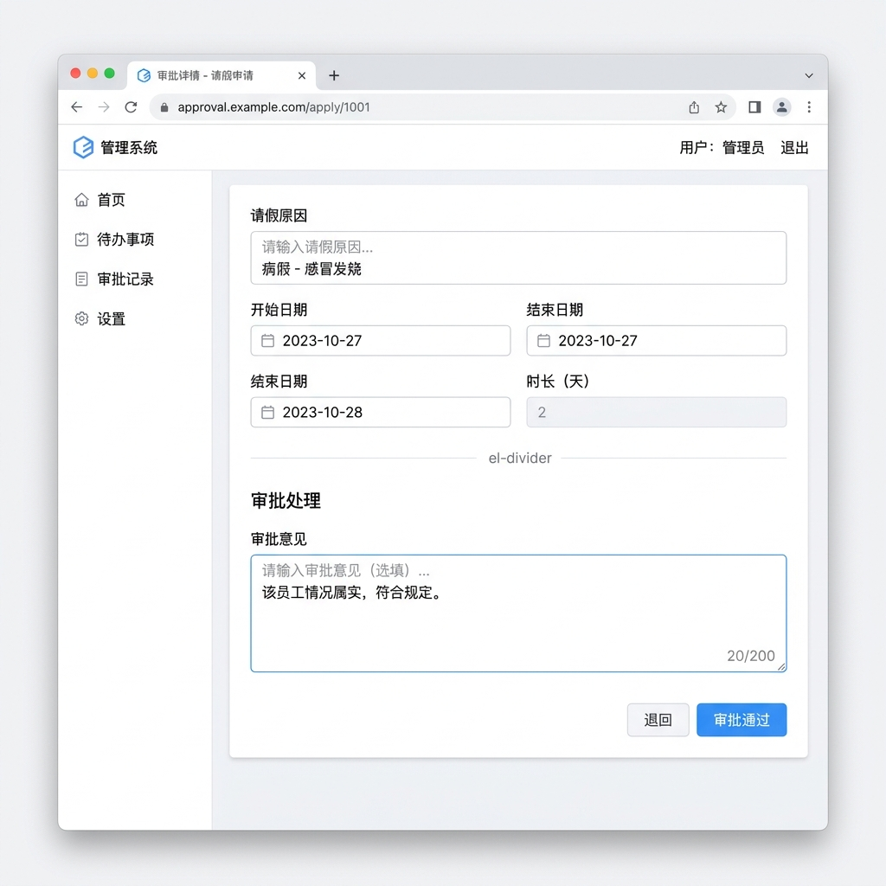
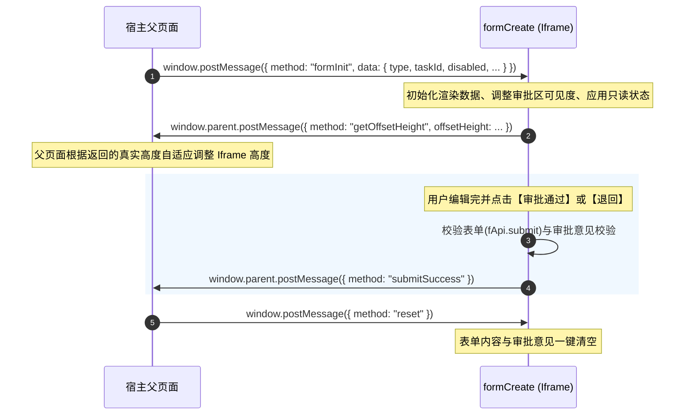

# formCreate.vue 渲染结构与交互机制剖析

在 `warm-flow-ui` 项目中，[formCreate.vue](file:///Users/alistar/code-all/bus/aether-all/references/warm-flow/warm-flow-ui/src/components/form/formCreate.vue) 组件扮演着**流程审批办理页与动态业务表单的承载器**。它被设计为在 `iframe` 中嵌套运行，并通过 `window.postMessage` 机制与父页面（通常是流程引擎的主页面）进行数据交互。

本报告对该表单的最终渲染形态和交互机制进行图文与交互式展示。

---

## 🎨 1. 线框图展示 (Mockup Wireframe)

下方是该组件在典型办理状态下的高保真原型渲染线框图。



---

## 🏗️ 2. 表单渲染结构划分

根据代码实现，整个表单页面包含 **ElForm** 容器，在视觉与逻辑上划分为两大核心区域：

### ➊ 动态业务表单渲染区
* **对应代码**：
  ```html
  <form-create
    v-model="formData"
    v-model:api="fApi"
    :rule="rule"
    :option="option"
    :disabled="disabled"
  ></form-create>
  ```
* **呈现逻辑**：
  这部分依托于 `@form-create/element-ui` 第三方库，表单具体的字段（如请假原因、报销明细等）不是写死的，而是根据父页面传入的 `rule` (JSON 规则配置) **动态渲染** 出来的。
* **主要控件**：通常包含常规的文本输入框 (`el-input`)、下拉选择器 (`el-select`)、日期时间选择器 (`el-date-picker`)、数字输入框 (`el-input-number`) 等。

### ➋ 审批意见与操作按钮区（受条件控制显示）
* **对应代码**：
  ```html
  <el-divider v-if="showApprovalFields"></el-divider>
  <el-form-item label="审批意见" prop="message" v-if="showApprovalFields">
    <el-input v-model="message" type="textarea" placeholder="请输入审批意见" ... />
  </el-form-item>
  <div style="text-align: right;" v-if="showApprovalFields">
    <el-button type="primary" @click="handleBtn('PASS')">审批通过</el-button>
    <el-button @click="handleBtn('REJECT')">退回</el-button>
  </div>
  ```
* **呈现逻辑**：
  该区域仅在 `showApprovalFields` 为 `true` 时渲染。它是一个带有分割线 (`el-divider`)、文本域输入框以及【审批通过】（蓝色高亮按钮）、【退回】（常规边框按钮）两个动作按钮的模块。

---

## 🔄 3. 业务场景与渲染状态切换

根据表单初始化时接收到的 `data.type`（即任务和状态来源），表单在渲染上会有三种截然不同的表现：

| 业务场景 | 传入的 `data.type` | 审批区是否显示 (`showApprovalFields`) | 表单是否置灰禁用 (`disabled`) | 渲染大体样式 |
| :--- | :---: | :---: | :---: | :--- |
| **待办任务办理** | `"0"` | **显示** (`true`) | **可编辑** (`false` 或根据外部设定) | **完整形态**：上方可编辑的业务字段 + 分割线 + 下方审批意见框 + 底部【审批通过】/【退回】按钮。 |
| **已办/历史记录** | `"1"` | **隐藏** (`false`) | **只读/禁用** (`true`) | **只读形态**：仅展示上方表单，且所有字段均为置灰置冷状态，不显示任何审批输入框或操作按钮。 |
| **已发布表单设计** | 其它 | **隐藏** (`false`) | **取决于传入配置** | **只读/预览形态**：仅展示上方动态表单内容，通常作为模板预览，无审批栏。 |

---

## ⚡ 4. iframe 跨页面消息机制 (postMessage)

该表单作为一个内嵌式页面，与外部系统的交互完全由消息驱动：



---

## 🖥️ 5. 交互式 HTML 模拟器

为了帮助您以最高效、最直观的方式体验和调试该组件的视觉效果，您可以使用以下本地的**可交互式模拟网页**。它还原了表单的 Element Plus 样式，并允许您在左侧控制面板中随意切换场景（`0` 待办，`1` 已办，`2` 已发布），实时查看表单在不同模式下的具体渲染效果。

* **模拟器文件**：[form_preview_demo.html](file:///Users/alistar/code-all/bus/aether-all/references/warm-flow/samples/form_preview_demo.html)
* **使用方式**：
  1. 点击上方文件链接在您的编辑器中查看，或在您的资源管理器中定位此文件。
  2. 使用任意浏览器直接双击打开运行。
  3. 您可以在左侧改变字段模板、任务类型和禁用标志，右侧将会以极高拟真度展示组件的视觉状态，并在左下角实时打出对应的消息日志（例如 `postMessage`）。

---

> [!TIP]
> **设计特点**：
> `formCreate.vue` 通过将业务表单解析能力 (`form-create`) 与通用审批交互界面分离，实现了一套“万能审批表单”。无论是请假申请、合同会签，还是采购报销，前端渲染逻辑都是同一套。后端只需设计好不同的 `rule` JSON 格式，便能让整个流程系统渲染出符合各类业务的审批详情页面。
