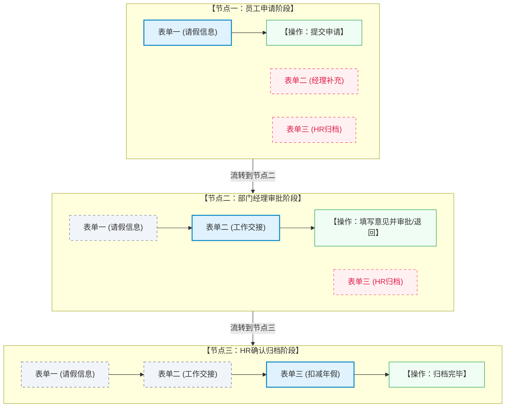

# 多节点自定义业务表单流转机制与设计指南

在工作流引擎（如 Warm-Flow）与动态表单设计器（如 `form-create`）结合的场景中，处理多节点流转且包含自定义业务表单时的核心设计原则是：**“写当前，读历史，藏未来”**。

针对您的三个核心疑问，以下是深入解答及可视化指导。

---

## 🧭 1. 核心疑问精准解答

为了方便理解，我们以一个包含 3 个节点的流程为例：
* **节点一（员工申请）**：填写“请假基础表单”（表单一）
* **节点二（部门经理审批）**：填写“经理补充表单”（表单二）
* **节点三（HR确认归档）**：填写“HR确认表单”（表单三）

### ❓ 疑问一：走到第二个节点时，渲染呈现结果是怎样的？
* **解答**：走到第二个节点时，渲染出的结果是：**展示“节点一的只读内容” + “节点二的可编辑内容”**。
* **第三个节点的内容呈现**：**根本不呈现（默认隐藏）**。
  > [!IMPORTANT]
  > 隐藏未来节点的内容，而非展示“空白框”，是工作流设计的最佳安全与视觉体验实践。这样可以避免界面被大量无关的空白输入框撑满，且能防止未来节点的数据输入要求提前泄露。

### ❓ 疑问二：在填写第二个节点表单时，是否能看到或填写第三个表单？
* **解答**：**不能看到，也无法填写**。
  - 在节点二的界面中，第三个表单处于**隐藏不渲染**状态，操作人甚至不知道第三个节点需要填写什么字段。
  - 第一个表单在节点二虽然可见，但已置灰为**只读（disabled）**，操作人只能查看，无法对其进行任何修改。只有第二个表单处于**可写/可编辑**状态。

### ❓ 疑问三：走到第三个节点时，是否会把第一个和第二个表单的内容都渲染出来展示？
* **解答**：**是的，第一个和第二个表单的内容都会渲染出来，但全部为“只读状态”**。
  - 流转到节点三时，前序步骤（节点一、节点二）录入的自定义业务字段会全部向下透传并还原出来。
  - 它们会以置灰的、无法编辑的形态展示在上方，作为 HR 最终审批与归档时的重要**业务上下文参考**。HR 只能填写属于自己节点三的自定义字段。

---

## 📊 2. 节点权限控制状态矩阵

在流程流转到不同节点时，后端通过向前端 [formCreate.vue](file:///Users/alistar/code-all/bus/aether-all/references/warm-flow/warm-flow-ui/src/components/form/formCreate.vue) 组件传递不同的渲染规则（Rules），动态改变每个表单模块的可见性 (`hidden`) 和禁用状态 (`disabled`)：

| 当前流转节点 | 表单一（请假基础） | 表单二（经理补充） | 表单三（HR归档） | 审批动作处理区 |
| :--- | :---: | :---: | :---: | :---: |
| **节点一：员工申请** | ✏️ 可编辑 | 🔒 隐藏 | 🔒 隐藏 | **隐藏** (仅显示“提交”按钮) |
| **节点二：经理审批** | 👁️ 只读 | ✏️ 可编辑 | 🔒 隐藏 | **显示** (可填通用审批意见并操作) |
| **节点三：HR确认** | 👁️ 只读 | 👁️ 只读 | ✏️ 可编辑 | **显示** (可填通用审批意见并操作) |
| **流程流转结束** | 👁️ 只读 | 👁️ 只读 | 👁️ 只读 | **隐藏** (仅展示归档后的历史数据) |

---

## 🎨 3. 业务流转时序与界面渲染可视化

下面是此流程在流转各阶段时的表单渲染演变图：

---

## 🖥️ 4. 多节点流转网页模拟器

为了让您能够更直观地“点击并感受”这套流转逻辑，您可以使用以下本地的多节点交互式模拟网页。在其中，您可以通过**步骤条**手动切换节点，实时预览在各个流转阶段下，右侧渲染出的表单界面变化：

* **模拟器入口**：[multi_node_flow_demo.html](file:///Users/alistar/code-all/bus/aether-all/references/warm-flow/samples/multi_node_flow_demo.html)
* **包含功能**：
  1. **步骤条控制切换**：可在“员工申请”、“经理审批”、“HR确认”与“流程结束”间任意跳转。
  2. **权限动态响应**：能够动态控制三个不同业务表单的展示策略（可编辑、只读、完全不呈现）。
  3. **数据追溯机制**：当前序节点输入数据后进入下一节点，前序表单字段不仅会变成只读，还会把输入的数据完整带下来，供后续审批查阅。
  4. **postMessage 抓取**：展示了表单提交事件将数据传给父页面的报文细节。

---

## 🛠️ 5. 技术实现思路 (针对 form-create)

在实际开发中，有以下两种主流的实现方案：

### 方案 A：单表单配置方案（适合中小表单）
将所有节点的字段定义在**同一个大 Rule** 中。在节点加载初始化时，后端或前端控制器通过遍历该 Rule 数组，根据当前所处节点，动态修改各个字段的 `props`：
* **当前节点字段**：设置 `hidden: false`, `disabled: false`。
* **历史节点字段**：设置 `hidden: false`, `disabled: true`。
* **未来节点字段**：设置 `hidden: true` 保证其完全不呈现。

### 方案 B：多表单动态挂载方案（适合复杂业务表单）
将每个节点需要填写的字段分别设计为**独立的表单模板**（例如在数据库中保存三个不同的 `formContent` JSON 串）。
* 在节点二初始化时，接口不仅返回当前节点的表单定义，还会额外返回历史步骤的表单定义。
* 前端在渲染时，循环使用多个 `<form-create>` 标签或将多个 Rule 数组合并拼接成一个长 Rule，并将历史表单对应的 Rule 中所有属性全局修改为 `disabled: true`。

---

## 🔍 6. 模拟器与真实代码的实现对比说明

为了防止产生混淆，以下将您在**模拟网页**中看到的交互与 [formCreate.vue](file:///Users/alistar/code-all/bus/aether-all/references/warm-flow/warm-flow-ui/src/components/form/formCreate.vue) 的**真实代码**进行详细对比：

### ➊ 按钮文字的差异
* **模拟器中**：按钮动态显示了 `【审批通过 (送节点三)】` 和 `【归档完毕 (结束流程)】`。
* **真实代码中**：按钮上的文字是**完全写死（硬编码）**的，即 **`【审批通过】`** 和 **`【退回】`**。
* **说明**：模拟器上的描述性文字是**我（AI）为了向您展示流程所处阶段而特意定制的辅助说明文案**，用于增强可视化效果。在真实项目中，按钮文案是固定且通用的。

### ➋ “跳转到下一节点”的触发与控制
* **模拟器中**：点击按钮后，网页步骤条和自定义表单会自动切换，这是本地 Vue 响应式状态模拟的效果。
* **真实代码中**：`formCreate.vue` 作为一个被 iframe 嵌套的子页面，**本身不具备直接改变流程节点或直接重定向跳转的能力**。
* **真实跳转的完整路径**：
  1. 用户点击 `【审批通过】`，触发 `executeHandle` 接口请求，将业务表单数据、审批意见发送给**后端**。
  2. **后端工作流引擎 (Warm-Flow)** 接收到请求后，在后台数据库中更新该任务的状态，并将流程实例移动到下一个审批节点。
  3. 后端处理成功并给前端返回成功响应后，`formCreate.vue` 通过 `postMessage` 向父窗口发送 `{ method: "submitSuccess" }` 消息。
  4. 外层的**宿主父页面**在监听到 `submitSuccess` 消息后，执行关闭弹窗、刷新待办列表或重定向的逻辑。
